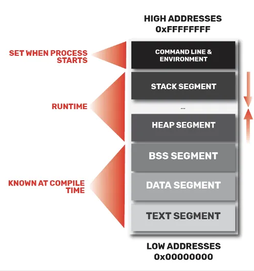
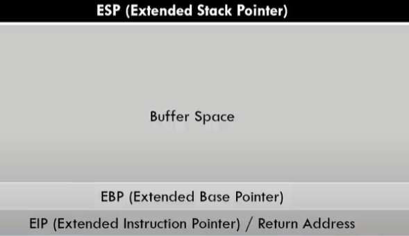
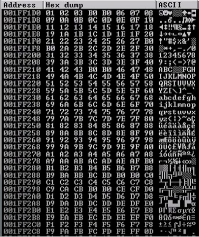

# Stack Buffer Overflow

## Process Memory

## Registry Pointers

	ESP (Extended Stack Pointer) - Will point to the next available byte on the stack
	EBP (Extended Base Pointer) - Will point to the base of the stack.
	EIP (Extended Instruction Pointer) - Will point to the memory address (the first byte) of the next instruction to be executed.

## Stack

By default, the stack grows downward in memory, so newer values are placed at lower memory addresses.

## The Overflow

The point of the stack buffer overflow attack is to send data to the buffer space of the stack, so that if overflows into the EBP and then to the EIP. If we can find the exact amount of bytes need to rech the EIP we can then send our own address to it, that will point to our payload.

## The Attack

### First Step: Spiking

To see if an application is vulnurebla to an stack buffer overflow attack we need to employ a technique called spiking.
This technique consists in sending a bunch of data to an application, until the stack buffer is overflown. Then if the application crashes it might be vulnerable, if it doesn't we move on and send data to the next endpoint of the application.

### Second Step: Fuzzing

Now that we found a vulnerable endpoint of the application. It's time to fuzz some data. The goal is to send data in such a way, that when the application crashes we can tell how many bytes of data are required to override the EIP.
At the end of this step we should have a general idea (overestimated) of how many bytes are necessary, so next we need to find out the exact amount.

### Third Step: Find the offset for the EIP

To find how much data we need to send until we start overriding the EIP we can use a metasploit tool: pattern_create.rb
This tool will create a specific pattern with the amount of bytes we need to crash the application, that allows us to know the offset of bytes till the EIP.

	pattern_create.rb -l <number_of_bytes>

We will send the pattern created to the application and when it crashes, using a debugger, we will notice what 4 bytes are currently in the EIP address.

Then we will give those 4 bytes to another metasploit tool called pattern_offset.rb

	pattern_offset.rb -l <number_of_bytes_of_the_pattern> -l <4_bytes_of_the_EIP>

This tool will retur the exact amount of bytes needed to send to application to fill the buffer to just before the EIP (in another words it returns the offset)

### Fourth Step: Finding bad characters

Now that we control the EIP (We know how many bytes of data until we can write to there EIP register), all that it's left is to put our payload in the data we are sending and then poiting the EIP to the beginning of the payload.

But before we do that, we need to see if there are any characters that might not be able to be processed by the program and therefore we cannot use in our payload.

To do this we will send data again to the application, but now containing all hex characters and see if they all appear correctly in the stack buffer. Usually if a character is not supported will be missing in the sequence or will be replaced by someother character that does not belong in the sequence. We need to take notice of all charecters that are missing in the sequence or have been replaced. These are the characters that we cannot use when we generate our payload.

## Controlling the EIP

Getting control of the EIP register is a crucial step of exploit development. There are two common ways to do this:

We can find the EIP by sending a unique string of bytes, identify the 4 bytes that overwrite the EIP, and then locate those four bytes in our unique buffer.
pattern_create.rb is a ruby tool part of metasploit the allows us to do this:

	locate pattern_create

	pattern_create.rb <number_of_bytes>

After identifying which bytes overwrote the EIP register we can now use the companion to pattern_create: pattern_offset.rb. This tool will discover the offset of the specific 4 bytes that overwrote the EIP in our unique string

	pattern_offset.rb <bytes>

Where do we redirect the execution flow now that we control the EIP register? Part of our buffer can contain the code (or shellcode) we would like to have executed. Our next steps will involve examining and preparing the psace for this shellcode, and figuring out a way to redirect code execution to it.

## Checking for bad characters

Thera maybe some characters that should be used in the buffer, return address or shellcode.
To find these characters just find a script that sends all possible characters from 0x00 to 0xff as part of the buffer and see how they are dealt by the application. If any of the characters don't appear, they were truncated and should not be used.